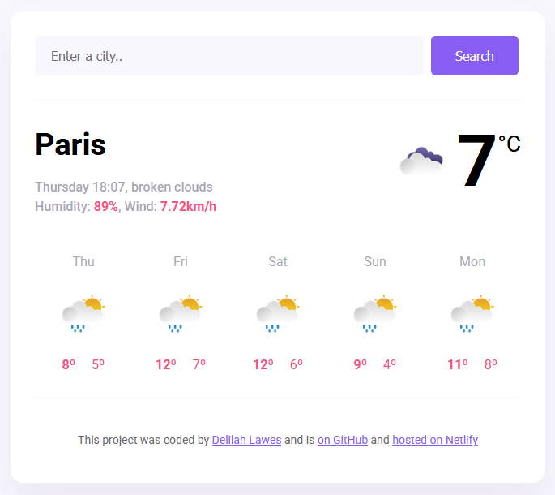

# Weather App

[](https://app.netlify.com/sites/lilah-weather-app-final/deploys)

## Description

A weather application developed as the final project for SheCodes Plus. This enhanced version includes a 5-day forecast feature alongside real-time weather information.

## Preview

<p align="center">
  
</p>

## Core Features

- Real-time weather data using SheCodes API
- Current temperature and conditions
- 5-day weather forecast
- City search functionality
- Wind speed and humidity information

## Technologies Used

- HTML5
- CSS3
- Vanilla JavaScript
- Axios for API requests
- SheCodes Weather API
- Vite as build tool

## Setup

To run this project locally:

```bash
# Clone the repository
git clone https://github.com/delilah-lawes/my-weather-app-forecast

# Install dependencies
npm install

# Create a .env file and add your API key
VITE_API_KEY=your_api_key_here

# Start the development server
npm run dev
```

## Deployment

This project is deployed on Netlify at: [lilah-weather-app-final.netlify.app](https://lilah-weather-app-final.netlify.app/)
